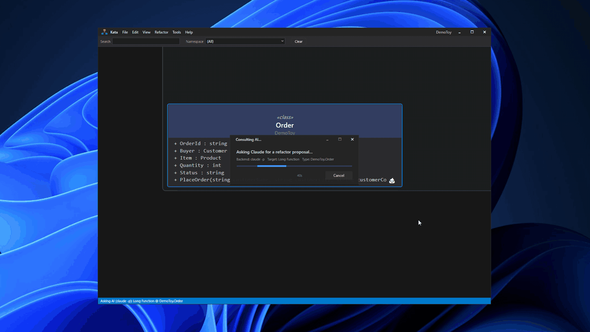

# Kata

**AI-agent-driven refactoring platform for real codebases.**

Kata exposes Fowler's refactoring catalog and code-smell detection through a
Model Context Protocol (MCP) server, so any AI agent — Claude Code, Codex,
your own — can drive whole refactorings against a real solution. A class
diagram surfaces the same intents in a UI when you want a human-in-the-loop
view.

The workflow, in one sentence: an agent reads the smells Kata detected,
proposes a diff, you preview it in the app, then apply it back to the source.
Changes flow back into the Roslyn workspace / C++/CLI project files, so
the diagram stays a live view of the code — not a static picture.



*20-second demo: right-click a `LongFunction` smell on `Order.PlaceOrder` → Ask AI (Claude) → preview the proposed diff → Apply. The bloated method is decomposed into `ValidateInputs` / `CalculateDiscountRate` / `CalculateTaxRate` / `BuildReceipt`. See the [full 3-minute recording](docs/assets/kata-demo-full.gif) for the complete flow.*


## Why it's different

- **MCP-native** — the refactor catalog isn't a plugin, it's the primary surface.
  75+ MCP tools cover load-solution, list-smells, propose-*, apply-change-set,
  quality-delta, so an agent can drive Kata alongside its own tooling.
- **Cross-language symbol index** — C# ↔ C++/CLI resolution works Ctrl+Click
  and refactor-wise across the boundary (the C++/CLI symbol layer in
  `Kata.Cpp` reimplements just enough Roslyn semantics to interop).
- **Whole-codebase Fowler catalog** — 47 refactoring intents wired through
  a `IIntentApplier<T>` strategy pattern, each MSBuild-free unit-testable.
- **Smell → refactor loop** — 24 Fowler smells detected as badges on nodes and
  members. The AI-fix flow reads the exact smell + local source, produces a
  unified diff, and hands you a preview dialog.
- **Live graph** — no sln reload after refactors; the diagram adapter updates
  incrementally.

## Supported inputs

- **C# projects** (via Roslyn) — full symbol semantics, cross-project refs,
  complete Fowler catalog
- **C++/CLI projects** — custom Roslyn-flavoured layer in `Kata.Cpp`, inline
  members, macros, hybrid symbol resolution across the C# ↔ C++/CLI boundary
- **Mixed C# + C++/CLI solutions** — the main dogfooding target. Ctrl+Click
  from a C# call site into a C++/CLI header and back.
- **ASP.NET Razor / Web Forms views** (as C# flavor) — view pseudo-types with
  cross-file rename

Additional language adapters (Java / Kotlin / Go / TypeScript) are in
development for a future release.

## MCP integration

Kata.Mcp is a Streamable HTTP server (per MCP 2026-07-28 spec), stateless by
default. Multiple agents can connect simultaneously alongside a running Kata
App instance. Common tools:

```
load_solution               list_projects            list_types
list_smells                  get_smell_context       propose_rename
propose_extract_method       propose_extract_class   apply_change_set
get_quality_delta            export_test_instruction
```

`apply_change_set` in standalone (headless) mode is opt-in via
`--allow-headless-apply` / `KATA_ALLOW_HEADLESS_APPLY=1` — by default a
human confirms the diff in `Kata.App`'s preview dialog first.

## Status

Kata is under active solo development by [@dhq-boiler](https://github.com/dhq-boiler).
It works well on the codebases it was built against; the surface is wide and
the edges are still rough. Bug reports and reproducible examples are the most
useful form of contribution right now.

## Community vs Pro

|                    | **Community** (this repo) | **Pro** ([kata.dhq-boiler.dev/pro](https://kata.dhq-boiler.dev/pro)) |
| :----------------- | :------------------------ | :------------------------------------------------------------------- |
| License            | PolyForm NC (source-available, free for noncommercial use) | Commercial (proprietary plugin) |
| Editor / diagram   | ✅ full                   | ✅ same base                                                         |
| Refactorings       | ✅ Fowler catalog         | ✅ + Team Collab (planned)                                           |
| Code smell badges  | ✅ 24 smells              | ✅ same                                                              |
| MCP server         | ✅ full 75+ tools         | ✅ same                                                              |
| AI diff apply      | ✅ **10 uses / month**    | ✅ unlimited                                                         |
| License upgrade    | —                          | Drop `Kata.App.Pro.dll` next to `Kata.App.exe` + enter key           |
| Pricing            | Free                       | $49 buyout / $150 seat·yr / $290 Business seat·yr                    |

Community is the same binary customers install; Pro is a small plugin DLL that
the Community loader picks up when a valid license key is present. There is
no separate installer. AI cost is on the user's own Claude / Codex subscription
either way — the Community monthly cap is a *value* gate, not a cost gate.

## Building

Requires .NET 10 SDK and Windows (WPF for the App; MCP host runs headless).

```powershell
dotnet build Kata.slnx
dotnet test  tests\Kata.Tests\Kata.Tests.csproj
dotnet run   --project src\Kata.App\Kata.App.csproj
dotnet run   --project src\Kata.Mcp.HostApp\Kata.Mcp.HostApp.csproj
```

Default MCP endpoint: `http://localhost:7345/mcp` (override with `KATA_MCP_URLS`).

The `Kata.App.Pro/` folder does **not** live in this tree — it's the private
plugin repo. Community builds fine without it; the ProLoader silently falls
back to `NoOpProFeatures`.

## Repo layout

```
src/
  Kata.Core/          — model, analysis, intents (language-neutral)
  Kata.Roslyn/        — C# language adapter (Roslyn)
  Kata.Cpp/           — C++/CLI parser + semantics
  Kata.Razor/         — Razor / Blazor view adapter
  Kata.WebForms/      — ASP.NET Web Forms view adapter
  Kata.App/           — WPF frontend
  Kata.App.PluginApi/ — public contract shared with the Pro plugin
  Kata.Mcp/           — MCP tool definitions
  Kata.Mcp.HostApp/   — MCP Streamable HTTP host executable
tests/
  Kata.Tests/         — xUnit
```

## Contributing

Issues welcome. Before opening a PR:

- Run `dotnet build Kata.slnx` and `dotnet test` — both must pass
- Match the existing style (no new comments unless they explain a
  non-obvious *why*, no dead code, no speculative abstractions)
- Note that this project is licensed **PolyForm NC**, not MIT — commercial
  use of contributed code requires the Pro license

## License

[PolyForm Noncommercial 1.0.0](./LICENSE). Free for personal, educational,
research, hobbyist, and other noncommercial use. For commercial use, buy a
Kata Pro license.

Copyright © 2026 dhq_boiler.
